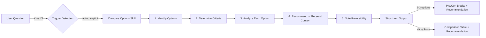

## Overview

Compare Options is a decision-support skill that produces structured pro/con analyses with clear recommendations when the user evaluates alternatives. It auto-triggers on comparison language ("should I use X or Y", "pros and cons", "trade-offs") or via explicit `/compare-options` invocation. Pure-prompt skill with no runtime code — the SKILL.md contains the full instruction set including output format templates, evaluation criteria selection, and anti-pattern guards.

## System Diagram



## File Map

```
compare-options/
├── SKILL.md              ← full skill: triggers, 5-step process, output templates, anti-patterns
└── architecture.md       ← this file
```
