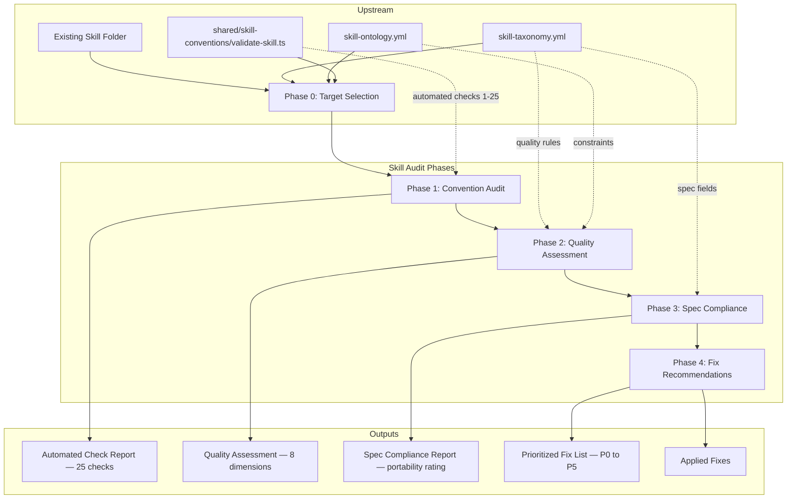

## Overview

The skill-audit is a guided conversational workflow that audits existing skills against the agentskills.io open standard and workspace conventions. It combines automated validation (25 checks via validate-skill.ts) with manual deep analysis of quality dimensions (token efficiency, signal-to-noise, specificity calibration, instruction patterns, script interfaces) and spec compliance (frontmatter portability, progressive disclosure). Rules are defined in `skill-taxonomy.yml` (classification) and `skill-ontology.yml` (relationships). Operational tooling lives in `shared/skill-conventions/`.

## System Diagram



## File Map

```
skill-audit/
├── SKILL.md                              ← orchestration: 5 phases with human gates
├── architecture.md                       ← this file

skills/ (root level)
├── skill-taxonomy.yml                   ← classification rules, quality dimensions
├── skill-ontology.yml                   ← cross-domain relationships, constraints
├── skill-topology.yml                   ← dependency wiring between skills
├── index.yml                             ← skill inventory (single source of truth)

shared/skill-conventions/                 ← operational tooling (shared with skill-creator)
├── tier-structures.yaml                  ← folder trees + decision criteria per tier
├── skill-template.yaml                   ← SKILL.md section schema per tier
├── list-profiles.ts                      ← extracts profile names from ~/.dbt/profiles.yml
└── validate-skill.ts                     ← automated 25-check validator
```
