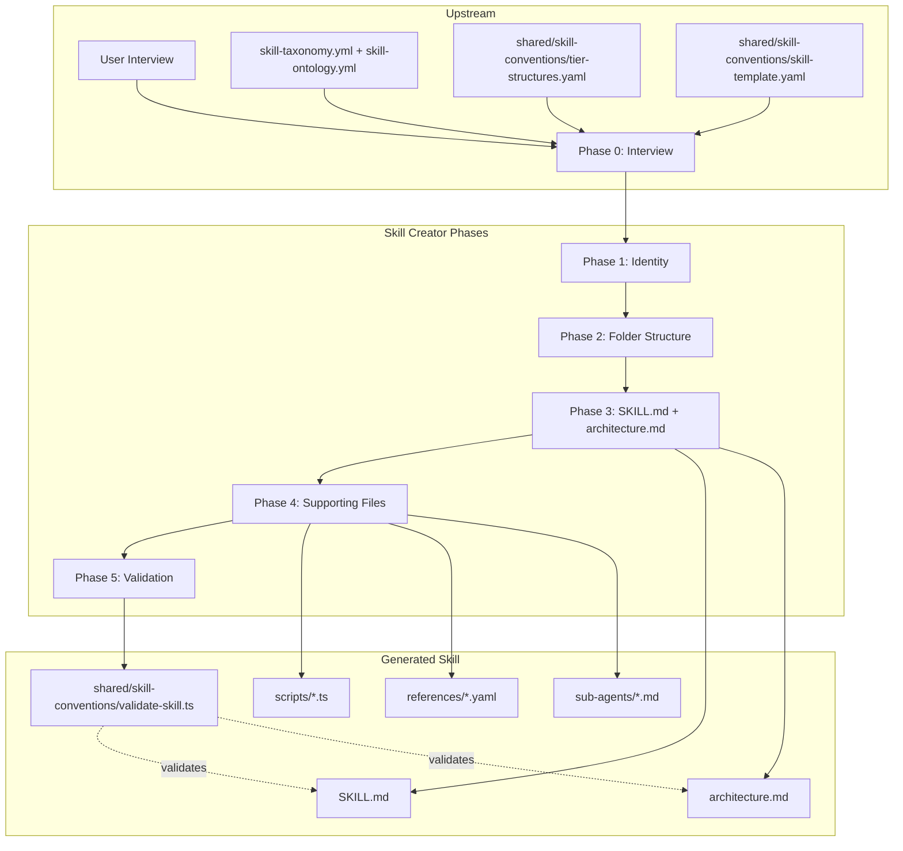

## Overview

The skill-creator is a guided conversational workflow that scaffolds new Claude Code skills. It interviews the user, generates a folder structure based on one of five complexity tiers, writes SKILL.md and architecture.md, creates supporting scripts and YAML reference files, then validates the result against workspace conventions. Convention data and validation logic live in `shared/skill-conventions/` (shared with skill-audit).

## System Diagram



## File Map

```
skill-creator/
├── SKILL.md                              ← orchestration: 6 phases with human gates
├── architecture.md                       ← this file

shared/skill-conventions/                 ← shared with skill-audit
├── (conventions.yaml removed — merged into skill-taxonomy.yml + skill-ontology.yml)
├── tier-structures.yaml                  ← folder trees + decision criteria per tier
├── skill-template.yaml                   ← SKILL.md section schema per tier
├── list-profiles.ts                      ← extracts profile names from ~/.dbt/profiles.yml
└── validate-skill.ts                     ← automated 11-check convention validator
```
