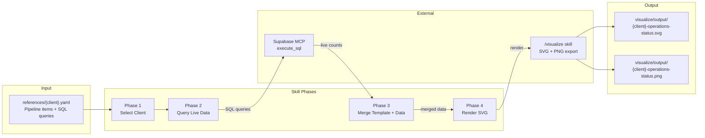

# Client Platform Operations Status — Architecture

## Data Flow

1. **YAML template** declares what pipelines, automation items, and summary stats exist for a client, along with SQL queries to fetch live counts
2. **Supabase MCP** executes each SQL query against the client's Supabase instance
3. **Merge** combines static structure (names, statuses, badges) with dynamic data (counts, breakdowns)
4. **Render** generates the SVG following the dark-theme operations dashboard layout, delegates to `/visualize` for PNG export

## Key Conventions

- Schema defined in `client_projects/client-status-convention.yml`
- Per-client YAML in `references/{client}.yaml` within this skill
- No TypeScript scripts — entirely LLM-driven via SKILL.md phases
- SVG layout matches the established `cuez-operations-status.svg` pattern
- Viewport height scales with pipeline item count (~60px per item)
